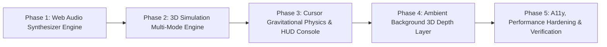

# Development Roadmap — Milestone v1.1

## Milestone: Interactive 3D & Creative Engineering

---

## Phases

### Phase 1: Web Audio Synthesizer Engine & Global Audio Control
- **Goal**: Implement zero-dependency Web Audio API oscillator synthesis and global audio state toggle.
- **Key Deliverables**:
  - `src/hooks/useSound.ts`: Oscillator sound generator (click, hover, mode switch, success chime).
  - Global audio state with `localStorage` persistence (`pawan-portfolio-sound`, default muted).
  - Sound toggle button integrated in `Navbar.tsx` with accessible ARIA state.
- **Verification**: Test audio triggers on click/copy in browser; verify persistence on page reload; verify silence when muted.

---

### Phase 2: Three.js Simulation Multi-Mode Engine
- **Goal**: Expand `HeroScene.tsx` with multi-mode simulation logic (`Matrix`, `Nebula`, `Vortex`).
- **Key Deliverables**:
  - Modular mode shaders and particle generators.
  - Smooth interpolation when transitioning between simulation modes.
  - Dynamic color theme palette mapping for each mode in both dark and light themes.
- **Verification**: Switch between Matrix, Nebula, and Vortex; verify geometry transitions and 60 FPS performance.

---

### Phase 3: Cursor Gravitational Physics & Interactive HUD Console
- **Goal**: Add real-time cursor physics and an accessible on-canvas HUD control console.
- **Key Deliverables**:
  - Vector proximity raycasting and elastic velocity impulses on mouse movement.
  - Interactive HUD component (`SimulationHUD.tsx` & `.module.css`) with mode selectors, speed slider, density toggle, and wireframe switch.
  - Touch interaction support for mobile devices.
- **Verification**: Interact with mouse cursor over hero canvas; manipulate HUD controls; test keyboard navigation on HUD buttons.

---

### Phase 4: Ambient Background 3D Depth Layer
- **Goal**: Add ambient spatial depth and subtle GPU-accelerated background particles across content sections.
- **Key Deliverables**:
  - `src/components/3d/AmbientCanvas.tsx`: Ultra-lightweight background particle canvas.
  - Viewport-aware rendering using `IntersectionObserver`.
  - Seamless integration behind Projects and Capabilities sections.
- **Verification**: Scroll through page; confirm smooth visual continuity without layout shifts or frame drops.

---

### Phase 5: A11y, Performance Hardening & Verification
- **Goal**: Final audit of accessibility, mobile responsiveness, memory cleanup, and build integrity.
- **Key Deliverables**:
  - `prefers-reduced-motion` compliance across audio, WebGL, and CSS animations.
  - WebGL context loss recovery and memory disposal validation.
  - Run full `npm run lint` and `npm run build`.
- **Verification**: Clean build output, zero ESLint warnings, 100% strict type safety, manual verification checklist pass.
