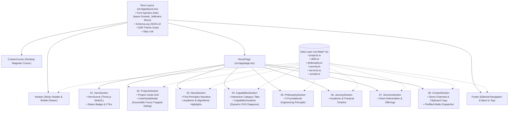

# System Architecture

## Architectural Philosophy

The architecture of **Pawan Uniyara's Portfolio** is built around the **"Digital Engineering Laboratory"** concept. It emphasizes:
1. **Zero-Latency Static Delivery**: Full Static Site Generation (SSG) for instantaneous page loads and optimal SEO.
2. **Decoupled Presentation & Data**: Clean separation between static data models (`src/data/`), UI component primitives (`src/components/ui/`), and narrative sections (`src/components/sections/`).
3. **Isolated Graphics Pipeline**: Three.js WebGL rendering runs completely outside React's reconciliation cycle to prevent unnecessary re-renders and CPU throttling.
4. **Resilient Client State**: Minimal client state, localized strictly where interaction is required (modals, nav toggles, cursor coordinates, and theme switching).

---

## Component & Data Flow Hierarchy

---

## Key Subsystems & Design Patterns

### 1. Rendering & Hydration Strategy
- **Static Generation (`output: export` compatible)**: The main route (`/`) renders statically during build, generating pure HTML/CSS.
- **Client Hydration Boundaries**: Components requiring browser APIs or state (`useState`, `useEffect`, `useRef`) are explicitly marked with `'use client'`.
- **Flash of Unstyled Theme (FOUT) Prevention**: An inline synchronous script in `src/app/layout.tsx` reads `localStorage` before the first paint and applies `data-theme` directly to the `<html>` root element.

### 2. 3D WebGL Pipeline (`HeroScene.tsx`)
- **Lifecycle & Execution Isolation**: Three.js instantiates directly onto a referenced canvas container. The `requestAnimationFrame` loop does not trigger React state changes.
- **Dynamic Viewport Pausing**: An `IntersectionObserver` watches the hero container. When scrolled out of view, the loop stops, bringing GPU/CPU utilization to 0%.
- **Adaptive DPR & Node Scaling**: Node counts scale dynamically based on device width (28 on mobile, 45 on tablet, 70 on desktop) and clamp device pixel ratio to max 2.
- **Theme Synchronization**: Listens for the custom `themechange` window event and updates Three.js scene ambient lights, node geometries, and point cloud colors dynamically.
- **Memory Disposal**: On unmount, all geometries (`OctahedronGeometry`, `BufferGeometry`), materials (`MeshStandardMaterial`, `LineBasicMaterial`, `PointsMaterial`), and the WebGL renderer context are explicitly disposed.

### 3. Modal & Interaction System (`CaseStudyModal.tsx`)
- **Accessibility Focus Trap**: Tracks `previousFocusRef` upon opening, forces initial focus to the close button, traps `Tab` / `Shift+Tab` cycling within the modal boundary, and closes on `Escape`.
- **Scroll Lock**: Toggles `document.body.style.overflow = 'hidden'` to prevent background scroll chaining during modal inspection.

### 4. Architectural Simulation Visualizer (`CapabilityVisualizer.tsx`)
- High-fidelity inline SVG diagrams representing computational architectures for each skill category:
  - `dsa`: Algorithmic binary tree traversal with $O(\log N)$ notation.
  - `frontend`: React component composition, virtual DOM layout, and token trees.
  - `backend`: Express middleware pipeline, REST router, and authentication filters.
  - `data`: Relational schema tables, ACID transactions, and document pipelines.
  - `creative`: Three.js scene graph, vertex/fragment shaders, and render loop.
  - `ai`: Neural network layer feed-forward and tensor computations.

---

## State Management

| State Scope | Management Mechanism | Notes |
| :--- | :--- | :--- |
| **Theme (Dark / Light)** | `useTheme` hook + `localStorage` + `data-theme` attribute | Dispatches global `themechange` custom event |
| **Active Section Tracking** | Scroll listener in `Navbar.tsx` | Calculates scroll offset against section bounding boxes |
| **Modal State** | `selectedProject` state in `ProjectsSection.tsx` | Passed to `CaseStudyModal` |
| **Active Capability Tab** | `activeTab` in `CapabilitiesSection.tsx` | Switches active category and visualizer diagram |
| **Contact Form & Clipboard** | Local component state in `ContactSection.tsx` | Tracks submission status and triggers confetti animation |
